<h1 align="center">Test app for it-company</h1>

  
  
  

  
This test application was developed for it-company to apply for a vacancy. It was created from figma view thats why where aren't any notifications, animations and so on. Looks well only in Light Mode.
To start this app quckly, I provide some test data, you can upload "test_data.json" into your FireBase Realtime database. 
To download or upload files, you have to create FireBase Storage with special hierarchy. For uploading files create: "/users/companies/[company owner from task]/documents/[task id]". 
Path paraments you can get from test_data.json file. For donwloading files hierarchy looks quite the same:\n
1. for licence "/users/companies/[company owner from task]/licences/[task id]" and don't forget to put here a file with name "test.pdf".
2. for user logo create "/users/employees/user/photo" and don't forget to put here a file with name "test.jpg".

 

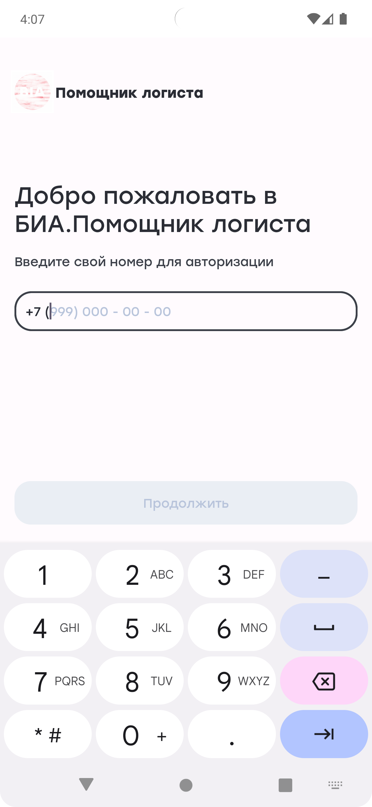
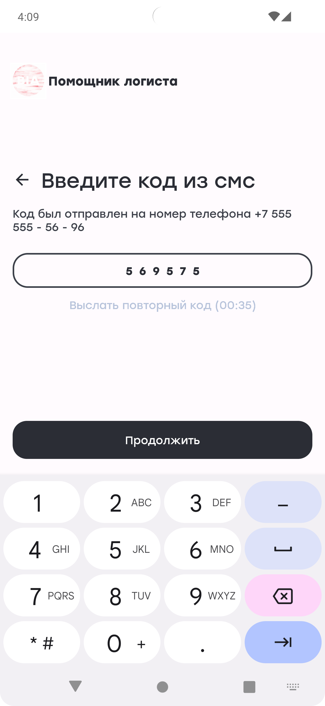
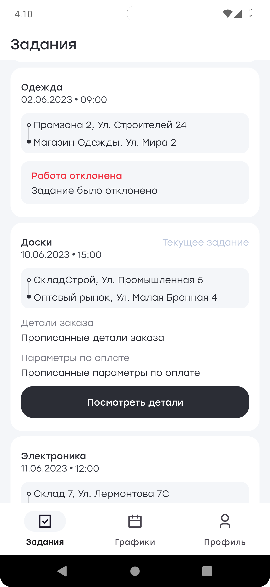
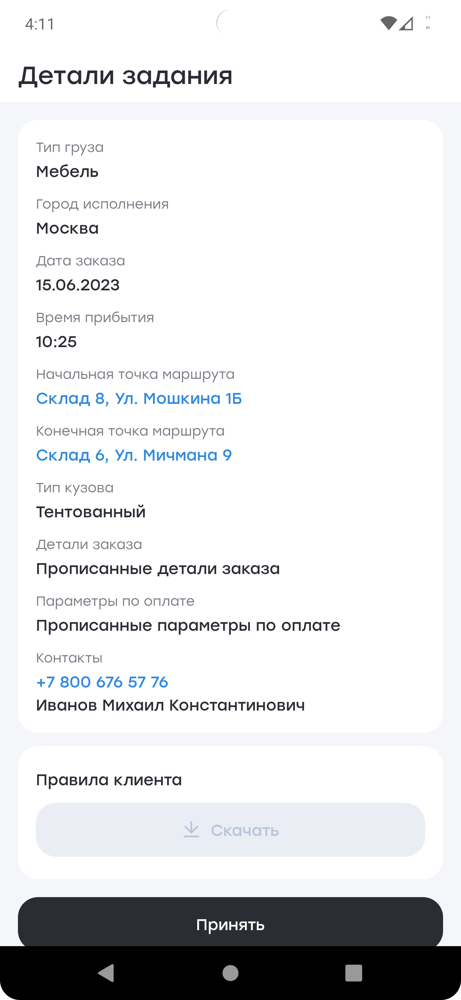
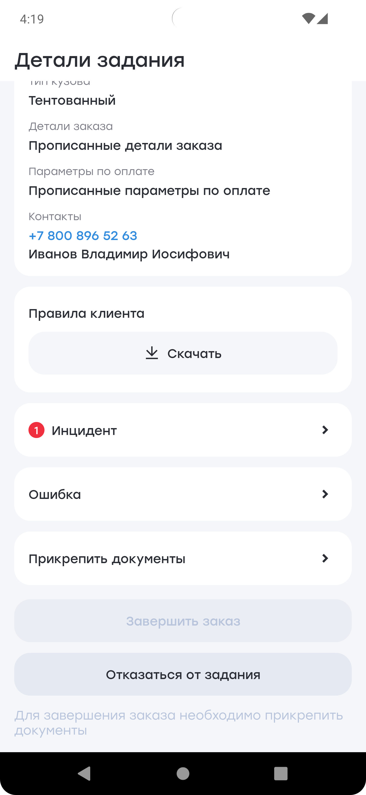
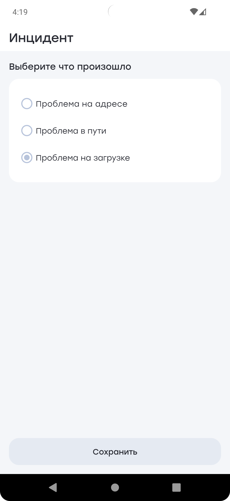
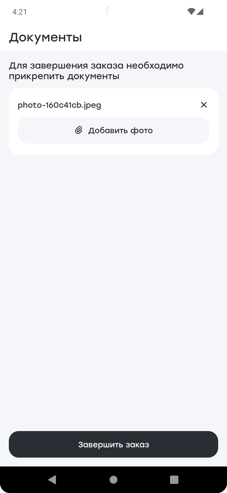
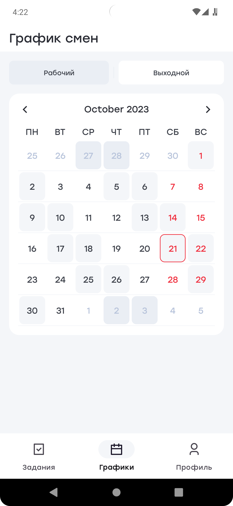
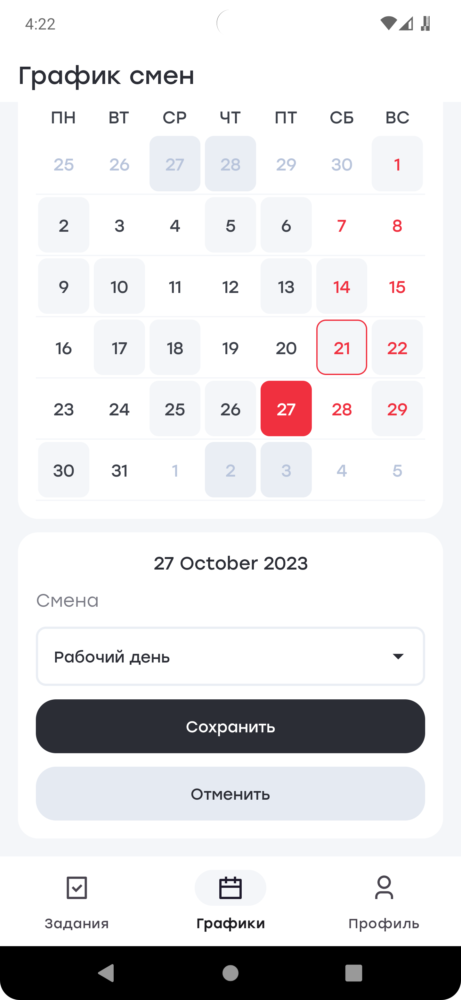
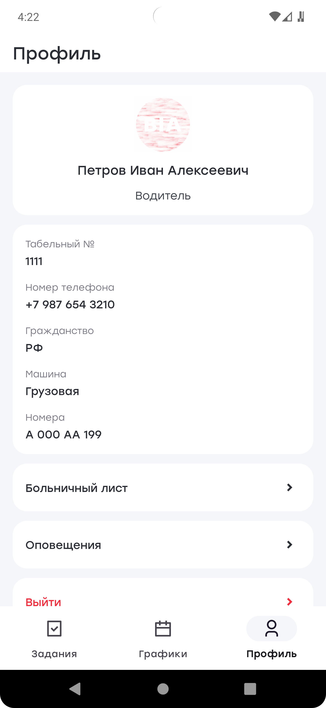
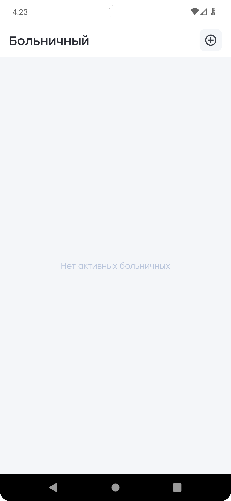
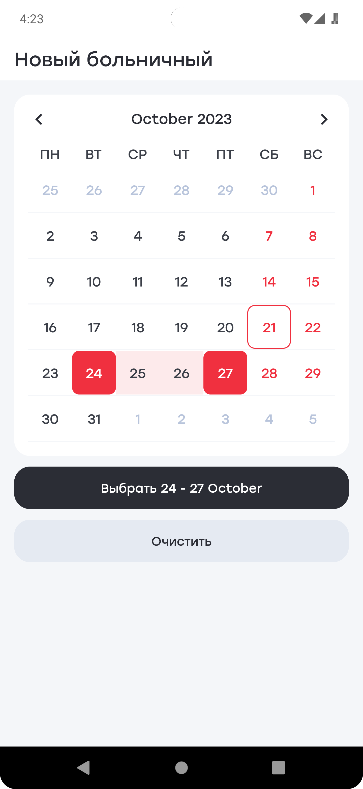
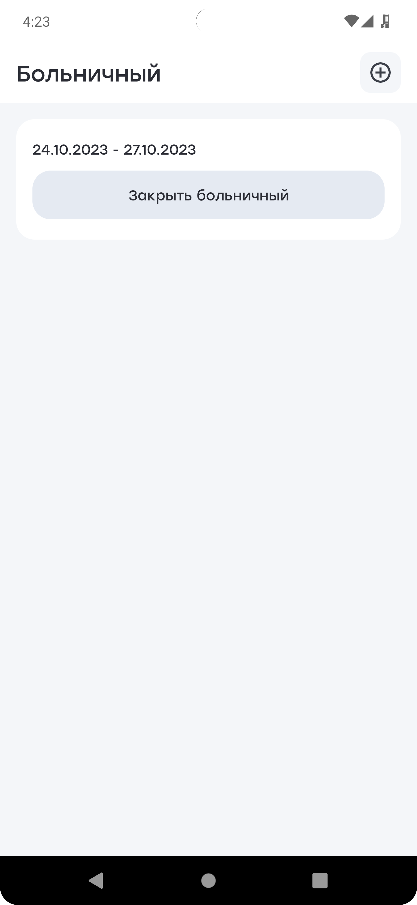

  
### Architecture
  * Clean Architecture
  * MVVM (Model - View - ViewModel)

### Technology Stack
  * [Kotlin](https://kotlinlang.org/)
  * [Coroutines](https://github.com/Kotlin/kotlinx.coroutines)
  * [FireBase](https://firebase.google.com/)
  * [Android Jetpack](https://developer.android.com/jetpack)
    * [LiveData](https://developer.android.com/topic/libraries/architecture/livedata)
    * [Lifecycle](https://developer.android.com/topic/libraries/architecture/lifecycle)
    * [ViewModel](https://developer.android.com/topic/libraries/architecture/viewmodel)
	* [ConstraintLayout](https://developer.android.com/training/constraint-layout)
	* [Architecture Components](https://developer.android.com/topic/libraries/architecture)
    * [Navigation](https://developer.android.com/guide/navigation)
    * [WorkManager](https://developer.android.com/topic/libraries/architecture/workmanager)
  * [Retrofit 2](https://square.github.io/retrofit/)
  * [GSON](https://github.com/google/gson)
  * [Material-Components](https://github.com/material-components/material-components-android)
  * [Glide](https://bumptech.github.io/glide/)